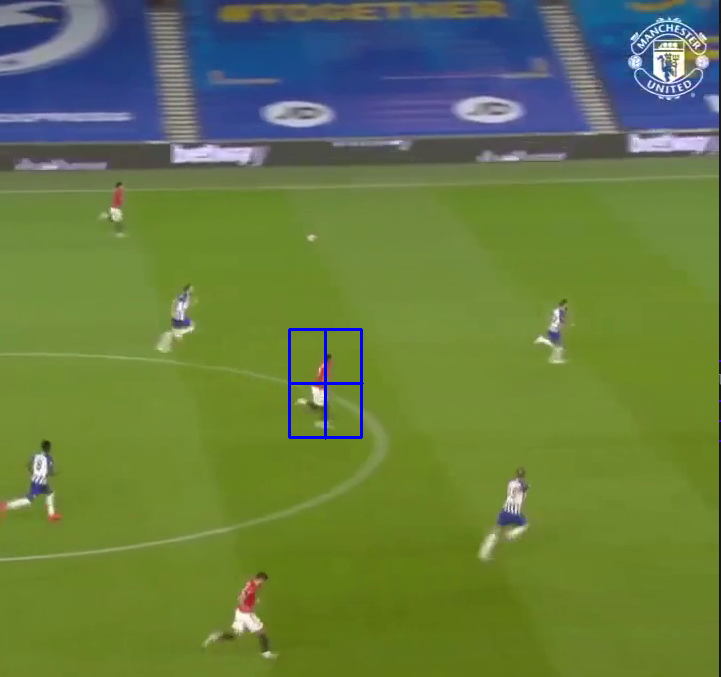

## Multiple Object tracking in openCV  

### Prerequisites  
A lot of modules used in the code are part of openCV's contrib package (link [here](https://github.com/opencv/opencv_contrib))  
Follow the steps for installation [here](https://pypi.org/project/opencv-contrib-python/)  
**Note**: The conrib package has both main & contrib modules

### Executing the code  
1. Make sure that you have the video(.mp4) and python file in the same directory.
2. Run the code with the command ``` python3 object_tracking.py ```  
3. Then press **s** to select a ROI (region of image) using your mouse.  
4. Press **Space** or **enter** to confirm your selection.  
5. The video will keep on playing and your selected object will be tracked throughout.  
6. Repeat steps 3 and 4 to select & track multiple objects  
**Note**: You can cancel your selection by pressing **c**

### Demo  
  

